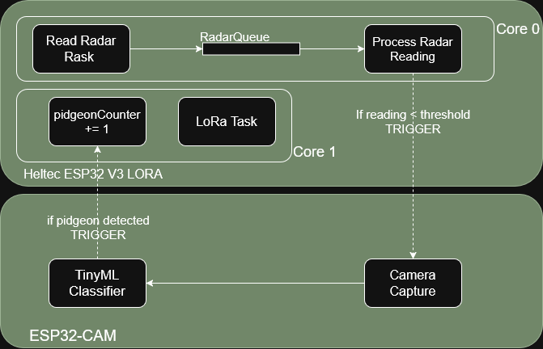
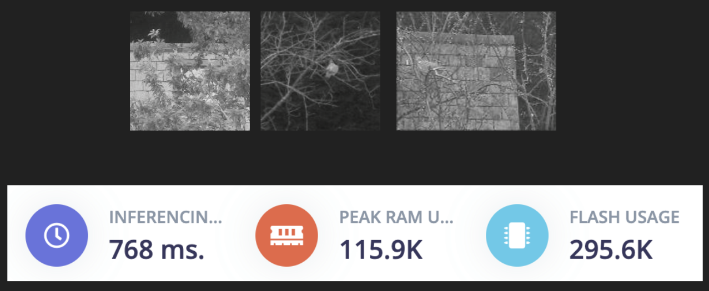
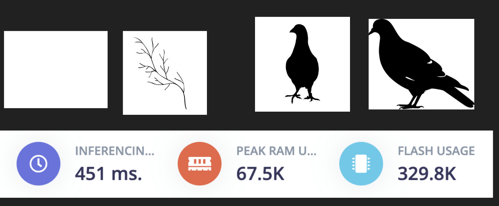
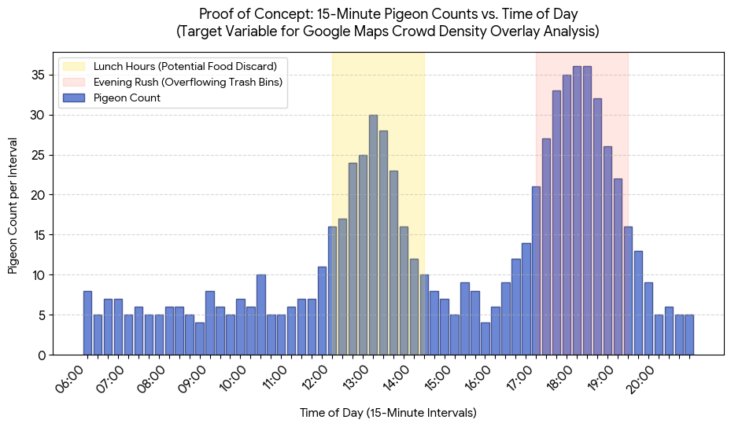

# PigeOff: Safeguarding Monuments with Smart IoT Deterrents

## Problem Description
Capital cities – like Rome – host a great number of monuments (statues, building facades, etc.) which poses local authorities the problem of pigeon infestation. These birds are abundant and often settle down on a monument, where they will stay for a while. Not only can their presence hinder the aesthetics of such a monument, but before a pigeon leaves they are also known to deface the monument by excrementing. These acidic droppings further ruin the aesthetics of statues, and can also damage their structural integrity.

Therefore it is essential that local authorities are equipped with proper means to combat these pigeons, of course in an animal-friendly, sustainable and cost-effective manner. That is where our system, **PigeOff**, comes in. It is an Urban Pigeon Deterrent System, designed to scare off pigeons nestling on Rome’s monuments. PigeOff is an innovative IoT solution designed to preserve urban monuments and public spaces. By integrating smart sensing, localized deterrents, and long-range connectivity, the system offers an automated, data-driven approach to managing pigeon populations in smart city environments.

## Existing Methods
Currently municipalities in Rome already use several methods to go about driving pigeons away from their monuments. 

The most common method is the use of netting / spikes, or other mechanical means of deterrence. These methods are quite functional, but the defense mechanisms are often very visible and can infringe upon the aesthetics of the monuments. 
	Another technique often used is the application of optical gel to the monuments. This gel is perceived by the pigeons as if it was fire and therefore they scare and leave the premises. However, the gel is a chemical substance and can damage the structures – even though it may still be less than the damage done by the pigeon droppings.
	Lastly, there have even been occasions where the municipality hired urban hawkers; professionals who let loose hawks which deter all types of malevolent birds in the vicinity. Of course, this method is very costly, and therefore undesirable.  

PigeOff addresses all the above limitations by allowing for invisible placements on statues, due to its small format. Moreover, the device would not damage the structure in any way and it is also cost effective.

---

## The Core Challenge & Constraints

Deploying an autonomous system in an urban environment introduces a strict set of operational constraints. PigeOff was engineered around three primary operational requirements:

* **7-Day Minimum Battery Life:** Essential to align with the standard maintenance intervals of municipality services.
* **The 10-Second Processing Window:** Our analysis shows the average stay time of a pigeon on a monument ledge is just **16.3 seconds**. Crucially, defecation typically occurs right before leaving. The system must wake up, detect, classify, and trigger deterrents in under 10 seconds to be effective.

---

## System Architecture & Hardware Pinouts

The PigeOff architecture splits responsibilities between a low-power **Heltec ESP32 v3 LoRa** node (handling radar/LiDAR parsing and long-range transmission) and an **ESP32-CAM** (handling intensive edge AI classification).
Note, that the LiDAR is a stand-in sensor due shipping issues, the sensor that is powered all the time was intended to be more energy efficient.

### Task Structure Overview
The system relies on an asynchronous multi-task structure to handle sensor sampling, queue management, and camera triggers concurrently.

### Hardware Interconnectivity

To simplify replication and maintenance, the physical wiring maps are structured across three distinct buses:

#### 1. Communication Link: Heltec LoRa to ESP32-CAM
| Heltec ESP32 v3 LoRa Pin | ESP32-CAM Board Pin |
| :--- | :--- |
| GPIO 2 | GPIO 13 |
| GPIO 3 | GPIO 14 |

#### 2. Range Sensing: Heltec LoRa to TF-Mini LiDAR
| Heltec ESP32 v3 LoRa Pin | TF-Mini LiDAR Wire |
| :--- | :--- |
| 5V | Red (Power) |
| GND | Black (GND) |
| GPIO 5 | White (TX) |
| GPIO 4 | Green (RX) |

#### 3. Debug & Flashing: ESP32-CAM to USB-to-TTL Adapter
| ESP32-CAM Board Pin | USB-to-TTL Adapter Pin |
| :--- | :--- |
| UOT | RX |
| GND | GND |
| U0R | TX |

---

## ESP32 Classifier: Optimizing for the Constraint Matrix

To prevent the power-hungry camera from draining the battery, the LiDAR sensor acts as a low-power trigger. When an object enters the detection threshold, the ESP32-CAM wakes up to run onboard image classification. Two model iterations were tested to find the optimal balance between accuracy and dataset constraints. 

At first we tried training a model using a dataset consisting of colored images with a resolution of 160x160. However, it quickly became apparant that this would be too taxing for the ESP-cam, and thus we scaled down all images to 96x96 and transformed them into grayscale, drastically reducing the number of input features for our classifier. This decision was supported by our assumption that statues (the background of the images) would be white and that in relation to that the pigeons would be black. 

Initially a more powerful model was trained (**MobileNetV1 (96x96 image size, 0.25 alpha scaling)**) on a more complex dataset we found on [Roboflow]([url](https://universe.roboflow.com/pigeon-sfe5r/pigeon-detection-6ompk/dataset/6/download)). After training and testing this dataset, we found out that the MobileNet classifier was too heavy to be run on the ESP-cam. 

Therefore, we decided to scale down the model to a single layer Convolutional Neural Network followed by a dense layer for classification. This approach indeed led to a model that was a lot more demaning for the ESP-cam's RAM. However, we noticed that the MobileNetV1 had a lower flash usage than our small handcrafted model. Reason for this is that we only use one max-pooling layer, followed by a flatten layer which connects one-to-one to our dense layer. This means that there are a lot of connections, and thus weights, between this flatten layer and the dense layer, leading to a larger amount of model parameters that have to be stored on the device. The MobileNetV1 does not suffer from this issue since it has clever mechanisms in place that circumvent the one-to-one connections by using a kind of averaging. Even though the flash usage was higher, the model still fit on the ESP-cam and because the RAM usage was significantly lower we could run it without issue.

Since the smaller classifier was less powerful and we were now working with the assumption of white backgrounds and black pigeons we also decided to swap to a different dataset. As you can see below this dataset consisted mostly of black pigeon stillhouettes against white backgrounds and as negative examples we showed it either completely white backgrounds or the stilhouettes of branches and leaves. Although the size of the dataset was only 60 images, we used a built-in feature in Edge Impulse to artificially increase the amount of training data (by rescaling, mirroring the same image a few times), in order to still have a sufficiently large dataset. Some more information and figures on the model performances can be found below.

### Model Iteration 1: MobileNetV1 Transfer Learning
Using a robust dataset processed via **Roboflow**, we trained a **MobileNetV1 (96x96 image size, 0.25 alpha scaling)** model inside **Edge Impulse**. 

* **Dataset Size:** 1,740 images
* **Data Split:** 80% Train / 20% Test
* **Characteristics:** High generalization accuracy across diverse lighting environments.

### Model Iteration 2: Handcrafted Feature Extraction
As a lean alternative, a specialized handcrafted dataset and model architecture were built directly in Edge Impulse to minimize processing overhead.

* **Dataset Size:** 60 images
* **Data Split:** 80% Train / 20% Test
* **Characteristics:** Rapid training time, optimized strictly for targeted landmark profiles.

## ESP-cam Code
The ESP-cam board was solely used to wake up once it receives a trigger signal from the ESP32-heltec board, take a picture, run the local classifier, and then based on the result send a signal back (in case a pigeon was detected) or do nothing. After this the ESP-cam goes back into deep sleep to reduce energy consumption.

All  the logic on the ESP-cam board is run inside the setup() loop. This is done because we basically put the board into sleep mode after every inference loop, so it runs its setup() loop once and then goes back to sleep. 

We found the camera had some issues running the classification right after waking up compared to when it was just running constantly. In the end we attributed this to the fact that when the ESP-cam wakes up the camera needs to stabilize, e.g. the first few frames are otherwise just pure white because the auto-exposure hasn't adjusted yet. To fix this, we delayed the camera about 1 second before taking a picture to run the inference. During this one second the ESP-cam takes three pictures in rapid succession and flushes them, as to stabilize the auto-exposure. 

After taking the image, it is first pre-processed before passing it to the local classifier. The pre-processing step is fairly simple, as in that it only turns pixels to full black if their grayscale value is below a certain threshold – otherwise the pixel is turned to white. We dod this as to make the image to be classified look as much like the training data the model has seen as possible. Some examples of what these transformations look like can be seen below (note: these are simulation images, they were not taken by the ESP-cam). 

The classifier was run locally by importing the library from Edge Impulse after training. The local classifier outputs a confidence score of seeing a pigeon. If it is above the threshold of 0.6 we put a boolean value to true and the ESP-cam is instructed to pull its response pin to HIGH for one second, in order to give the ESP32-heltec time to receive the signal. 

---

## LoRaWAN 

### Technical Details

We use LoRa to transmit the count of pidgeons every 15 minutes. The number is a way of balancing energy constrains with analysis power. This is a granularity that allows us to map how pidgeon behaviour is affected by opening times of restaurants

We use unconfirmed uplinks to conserve energy, since a missed uplink is not essential at this stage of the process.

In current location the uplinks are sent with a spreading factor of 7: This is a low spreading factor, that is energy efficient due to shorter radio times. We note, that this depends on the location of the node (specifically, its' distance to the nearest LoRa gateway).

### Sample Analysis

The final analysis of a day using the pidgeon counts would look something like this: 

The following analysis questions could be tackled with this:
* Does human presence deter or attract pigeons?
* Do smells and crumbs coming from open food establishments attract pidgeons?
* Does the trash from closing restaurants attract pidgeons? 

**PigeOFF** deters pigeons but also allows us to perform analysis that can help us in future approaches to tackling the problem of pigeons in urban environments.

## Measured Pigeon Activity
After posting at a fountain statue at Piazza Vittorio Emanuel in Rome, we found there landed in one hour 20 pigeons on the statue and 6 other birds – this is be relevant, as our classifier is not strong enough to distinghuish between pigeons and other birds. These pigeons stayed on the statue for averagely 16.3 seconds. These pigeon observations were made between 11:00 and 12:00 in the morning. This alligns with the strict daily scheduels pigeons adhere to. Namely, on another occasion we posted at another monument in Rome, but to no avail – no pigeon landed there for an entire hour, even though there were plenty of specimen present in the near vicinity. This again alligns with pigeons' daily schedules, as they often go back to foraging and feeding after their midday rest. 

## System Performance

| Distance | Lidar FN | Lidar FP | Camera FN | Camera FP | LiDAR F1 | Camera F1
| :--- | :--- | :--- |:--- |:--- |:--- |:--- 
| 20 | 0% | 20% | 10% | 0% | 88.89% | 94.74%
| 40 | 10% | 0% | 40% | 0% | 94.74% | 75.00%
| 80 | 30% | 0% | 60% | 0% | 82.35% | 57.14%

## Energy consumption
In order to achieve the goal of a 7-days operation time via battery, we implemented different sleeping routines and measured the energy consumption of the whole system to calculate the optimal battery capacity to power our detecting system. Since the ultrasound actuator to scary the pigeons was not implemented, it was not considered in the energy calculations.

*NOTE:* in our original idea, we wanted to use a radar movement sensor (LD2410S), though for home smart appliances, to operate as the switch to turn awake our system if any movement is detected. This sensor was chosen due to its theoretical little energy consumption, but at the end we where not able to implement it due to shipment issues (2 months after the order, the sensor is still in China). For this reason we implemented the switch part using a LiDAR sensor, kindly provided by the professor, which we set it up to work as a movement sensor by turning on our system when the distance measure is distrupted under a certain value for more then 4s straight. Although the LiDAR worked perfectly as this constrained movement sensor, it was not a valuable alternative for the radar sensor as its energy consumption is much higher then the radar one and is dependent on the distance it is measuring, making it not ideal for a set up that has to stay outside. For this reason measures taken from the LiDAR sensor are reported but not considered in the calculation of the ideal battery size for the final product, as it should implement the radar instead, which will be considered using the theoretical data reported in its [manual](https://www.tinytronics.nl/product_files/006002_HLK-LD2410S_datasheet.pdf).

In the following discussion all the measured data were obtained via direct measurement with a INA219 powered separately with a ESP32, which also streamed the data to a pc via usb, while all the theoretical calculations are done using data from the manual and the formula for the power:

$$ P = i \cdot V. $$

### Energy consumption of the ESPCam
In the following image we can see the energy consumption of the ESPCAM during the [demo](https://youtu.be/5cjZkr73Wsk). We can clearly see the moments in which the ESP32 wakes up from deep sleep the ESPCAM board, which consumes as follows:

|---  | Measurements 
| :--- | :---
|Average sleeping mode power | 25-27 mW
|Average energy consumption when pigeon is detected | 0,34 mWh 
|Average energy consumption when pigeon is not detected | 0,23 mWh 

  
   
  <em>Energy consumption of the ESPCAM during the DEMO, showing the difference between detection, not detection and sleeping mode power required by the CAM to operate and do the inference locally.</em>

### Energy consumption of the LiDAR
From our experiments, we found out that the energy consumption of the LiDAR sensor is highly dependent on the distance it is measuring, as we can see in the following table and image. Considering that this sensor should frequently be up to act as a switch for the whole system, and moreover work in an outdoor environment characterized by long distances when nothing is detected, we would not suggest it as the optimal solution for a potential final product, although we decided to use it for the purpouse of implementing the sleeping routines.

|---  | Energy consumption 
| :--- | :---
|Average short range (40cm) | 245 mW
|Average long range (80cm) | 283 mW
|Average outdoor range (more then 300cm) | > 450 mW

  
   
  <em>Energy consumption of the LiDAR sensor, where is clearly visible the high energy cost of the instrument and the difference between long range (high energy consumption) and short range (low energy consumption) distance measures.</em>

### Energy consumption of the Heltec ESP32 v3
In order to consume as little as possible and still detect the presence of pigeons, we operated the ESP32 in a light sleep mode, which turns on the LiDAR sensor every $\sim 1s$ to reduce its power consumption and turns on only when the LiDAR sensor detects the presence of an object for 4 times in a row. Then it wakes up the ESPCAM which takes a picture and runs locally the tinyML inference model to determine if the thing detected by the LiDAR is a pigeon or not. If it was a pigeon, the ESP32 counts it and sends an aggregated value of the number of pigeon detected via LoRAWAN every 60 seconds.

This whole sistem at work can be seen in the following picture, in which we can clearly see the short peaks representing the activations of the LiDAR sensor by the ESP32 and the difference between the active and sleeping modes. The average power consumption of each phase is reported in the following table:

|---  | Energy consumption 
| :--- | :---
|Light sleep mode| 46 mW
|Active mode | 204-220 mW
|LoRA transmissions| > 800 mW

In order to extimate the total energy consuption of the system, we have done the following approximations based on the averages from the data:
* on average, the routine after a trigger from the LiDAR takes $\Delta t \sim 9 s$ while it consumes $\Delta E \sim 0,54 mWh$
* on average, the systems stays in sleeping mode for $\Delta t \sim 0,9 s$, while stays in active mode while checking the LiDAR sensor data for $\Delta t \sim 1 s$;
* assuming that all the time the ESP32 is not in the detection routine is a continuous cycle between checking the LiDAR and sleeping, we can then determine that $\sim 52%$ of that time it is in active mode and the remain it is sleeping.

  
   
  <em>Energy consumption of the ESP32 while showing an image of a pigeon to simulate the environment and activate the cycle LiDAR + ESPCAM inference.</em>

### Theoretical consumtion of the radar movement sensor
From the nominal data present in the manual of the LD2410S radar sensor of our choice, it appears that is operating on $\Delta V = 3.3V$ and with typical current of $i = 0,12 mA$, which gives us a theoretical power consumption around $P_{theo} \sim 0,396 mW$.
### Conclusions
Now that we have evaluated the power consumption of all the parts of the system we can do an extimation of the total energy required by it to run ideally for 7 days. In order to do so, we will work under the following assumptions, that will make us do an upperlimit extimation, which should guarantee the performance of our PigeOff setup:
* we assume that every hour the system is activated 16 times (due to our observations in peak pigeon activity time);
* further more, we assume that each time a pigeon is detected,
* we assume that it will work also during night (although we did not test the ESPCAM at night);
* we assume to use a radar sensor instead of the LiDAR one, always active;
* the used battery will have to keep $\Delta V =5 V$.

Said so, we calculated the following energy consumptions per hour:
* for the ESPCAM, on average one detection takes $\Delta t \sim 3 sec$, which gives us every 1h deep sleep for $3552 s$ and $16$ times active, giving us $\Delta E \sim 31,1 mWh$
* for the theoretical radar sensor, always on, we have  $\Delta E \sim 0,4 mWh$
* with the considerations already written, we calculated for the ESP32 a power consumption of $\Delta E \sim 130,6 mWh$
* obtaining a total energy consumption per hour of the system of $\Delta E_{T} \sim 162 mWh$

  
   
  <em>Energy consumption of the ESPCAM and the ESP32 fully operating, with visible peaks when the ESPCAM is activated.</em>

  
   
  <em>Energy consumption of the ESPCAM and the ESP32 fully operating, with visible peaks when the ESPCAM is activated.</em>

With this $\Delta E_{T}$ per hour extimation we can easily calculate the weekly maximum energy consumption
$$ 162 (mWh) \cdot 24 \cdot 7 = 27225 (mWh)$$

and thus the ideal battery capacity of $ 27225 (mWh) / 5V = 5445 mAh$, which is roughtly the capacity of a smartphone battery.

## Team Members

| Name | ID (Matricola) | Profile |
| :--- | :--- | :--- |
| **Anja Škrlj** | 2285543 | [LinkedIn](https://www.linkedin.com/in/anja-škrlj-13aa852a1) |
| **Filippo Zanei** | 2285059 | [LinkedIn](https://www.linkedin.com/in/filippozanei/) |
| **Teun Boekholt** | 2284223 | [LinkedIn](https://www.linkedin.com/in/teun-boekholt-a41205255/) |

---

## Project Presentations

Documentation and progress reports for the PigeOff system are cataloged below:

| Milestone | Date | Documentation |
| :--- | :--- | :--- |
| **1st Deliverable** | -- / -- / ---- | [📄 View Presentation](PigeOFF_presentation.pdf) |
| **2nd Deliverable** | 10.04.2026 | [📄 View Presentation](PigeOFF_presentation.pdf) |
| **3rd Deliverable** | 29.05.2026 | 

---

## Core Documents 

**Concept** -> |[PigeOff – Concept.pdf](https://github.com/user-attachments/files/28297049/PigeOff.Concept.pdf)|
**Design** -> | |
**Evaluation** -> ||

---
