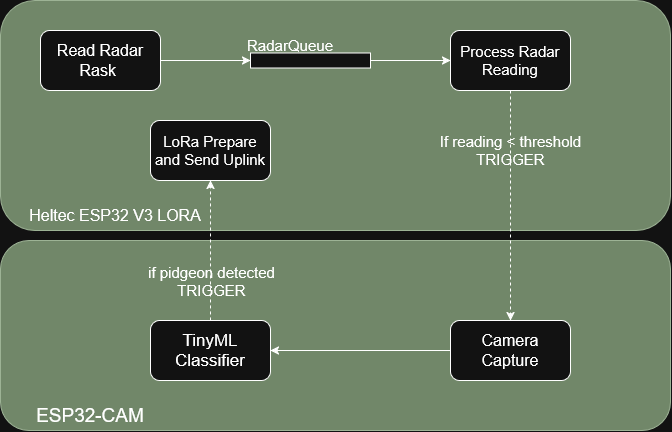

# PigeOff: An Urban Pigeon Deterrent System

**PigeOff** is an innovative IoT solution designed to preserve urban monuments and public spaces. By integrating smart sensing, localized deterrents, and long-range connectivity, the system offers an automated and data-driven approach to managing pigeon populations in smart city environments.

## Setup

Pin Map Tables: so we dont forget

| heltec esp32 v3 LORA | esp32-CAM board | 
| :--- | :--- | 
| 2 | 13 | 
| 3 | 14 | 

| heltec esp32 v3 LORA | tf-mini lidar |
| :--- | :--- | 
| 5V | (RED) | 
| GND | GND | 
| 5 | (WHITE) | 
| 4 | (GREEN) |

| esp32-CAM board | USB-to-TTL serial adapter |
| :--- | :--- | 
| UOT | RX | 
| GND | GND | 
| UnR | TX | 

## Task structure 

## Team Members

| Name | ID (Matricola) | Profile |
| :--- | :--- | :--- |
| **Anja Škrlj** | 2285543 | [LinkedIn](https://www.linkedin.com/in/anja-škrlj-13aa852a1) |
| **Filippo Zanei** | 2285059 | [LinkedIn](https://www.linkedin.com/in/filippozanei/) |
| **Teun Boekholt** | 000000 | [LinkedIn](https://www.linkedin.com/in/teun-boekholt-a41205255/) |

---

## Project Presentations

Documentation and progress reports for the PigeOff system are cataloged below:

| Milestone | Date | Documentation |
| :--- | :--- | :--- |
| **1st Deliverable** | -- / -- / ---- | [📄 View Presentation](PigeOFF_presentation.pdf) |
| **2nd Deliverable** | 10.04.2026 | [📄 View Presentation](PigeOFF_presentation.pdf) |

---
